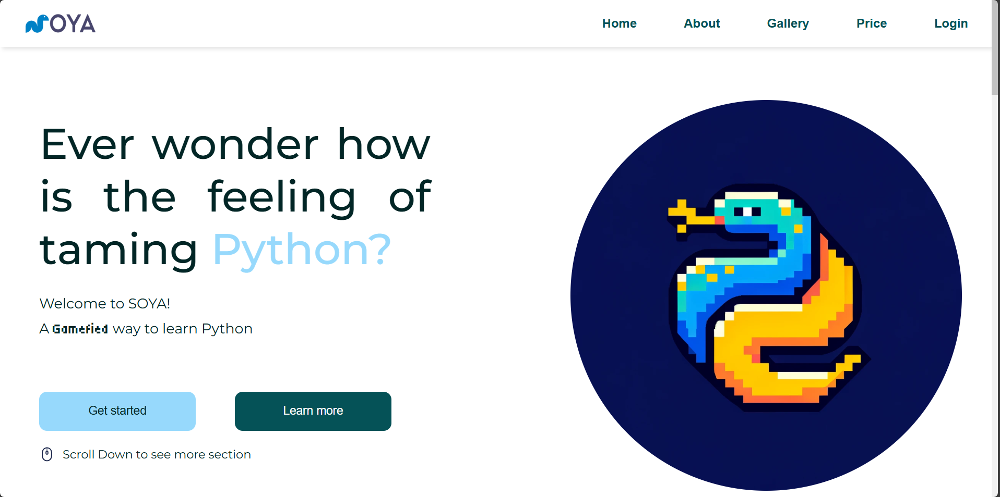

# SOYA

- - -

## Table of Contents

1. [Disclaimer](#Disclaimer)
2. [Introduction](#introduction)
3. [Steps to Run the Project](#Steps-to-Run-the-Project)
4. [About Our Team](#About-Our-Team)


- - -


# Disclaimer
This repository is part of a software development project module assignment and is created for educational purposes only. It is a student project from Asia Pacific University (APU) and does not provide any warranty or guarantee, either expressed or implied, regarding the accuracy, completeness, or performance of the software. Use of this software is at your own risk, and the author is not responsible for any issues, damages, or losses that may arise from its use.

# Introduction
<br>
We are students from Asia Pacific University, and this is our Software Development Project titled SOYA. This project is part of our academic coursework and serves to demonstrate the skills and knowledge we have acquired in software development.


---

# Steps-to-Run-the-Project

1. **Create Virtual Environment**  
   In the project root, create a virtual environment:
   ```bash
   python -m venv venv
   ```

2. **Activate Virtual Environment**  
   Activate the virtual environment:
   ```bash
   venv\Scripts\activate
   ```

3. **Install Dependencies**  
   Install the required dependencies from the `requirements.txt` file:
   ```bash
   pip install -r requirements.txt
   ```

4. **Restart Terminal**  
   If necessary, restart the terminal after installing dependencies.

5. **Activate Virtual Environment Again (If Needed)**  
   In case the virtual environment isn't active after restarting, activate it using one of the following commands:

   ```bash
   venvat
   ```
   or
   ```bash
   venv\Scripts\activate
   ```

6. **Split Terminal**  
   Open a split terminal to run the frontend and backend servers simultaneously.

7. **Start Frontend**  
   In the first terminal, navigate to the `frontend` directory:
   ```bash
   cd frontend
   ```
   Start the frontend development server:
   ```bash
   npm run start
   ```

8. **Start Backend**  
   In the second terminal, navigate to the `backend` directory:
   ```bash
   cd backend
   ```
   Start the Django server:
   ```bash
   python manage.py runserver
   ```

9. **Open the Browser**  
   Once both servers are running, open any browser and navigate to:
   ```
   http://localhost:3000/
   ```
10. **Open the serverside of SOYA**
    open any browser and navigate to:
    ```
    http://127.0.0.1:8000/
    ```
---


<br>

# About-Our-Team


I'm CHONG KELVIN feel free to visit my [GitHub Profile](https://github.com/kelocker), where I host various open-source projects and contributions.

I'm LIM GEN JACK, you're welcome to explore my [GitHub Profile](https://github.com/Jack-1118), where I showcase a collection of open-source projects and notable contributions.

I am HEW YEE KIT. I have helped my team in building this project for our assignment with troubleshooting the codes and fixing any known bugs to make the program to run smoothly without any issues.

I am CHUA HUI WEN. To delve deeper into my portfolio and accomplishments, feel free to explore my [GitHub Profile](https://github.com/CHUA1605).
<br>


